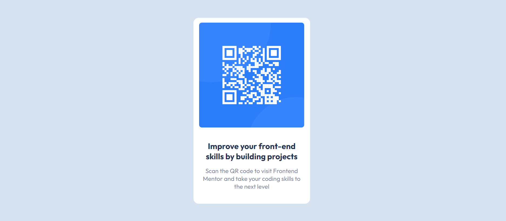

# Frontend Mentor - QR code component solution

This is a solution to the [QR code component challenge on Frontend Mentor](https://www.frontendmentor.io/challenges/qr-code-component-iux_sIO_H). Frontend Mentor challenges help you improve your coding skills by building realistic projects. 

## Table of contents

- [Overview](#overview)
  - [Screenshot](#screenshot)
  - [Links](#links)
- [My process](#my-process)
  - [Built with](#built-with)
  - [What I learned](#what-i-learned)
  - [Useful resources](#useful-resources)
- [Author](#author)

## Overview

### Screenshot




### Links

- Solution URL: [https://www.frontendmentor.io/solutions/flexbox-using-css-xS7DtaFAHe](https://www.frontendmentor.io/solutions/flexbox-using-css-xS7DtaFAHe)
- Live Site URL: [https://s-cw.github.io/FrontEnd-mentor-challenge-QR-code-component/](https://s-cw.github.io/FrontEnd-mentor-challenge-QR-code-component/)

## My process

### Built with

- HTML
- CSS custom properties
- Flexbox


### What I learned

Flexbox is a simple and convenient way of creating a flexible layout without using float or positioning. It comes with many uses like vertically centering a block of elements inside its parent to creating children inside a container to have the same amount of the available width/height.

Here is a snipper of what I have learn and applied into this challenge

```css
.container {
    display: flex;
    align-items: center;
    justify-content: center;
    flex-direction: column;
}
```

Edit:

I have decided to use CSS Grid instead of Flexbox as suggested and managed to reduced alot of unnecessary code. The page is fully responsive now as well

```css
body {
    display: grid;
    place-content: center;
    min-height: 125vh;
  }
```


### Useful resources

- [Flexbox center element](https://developer.mozilla.org/en-US/docs/Web/CSS/Layout_cookbook/Center_an_element) - This helped me for centering some of the elements. I really liked this pattern and will use it going forward.
- [Flexbox article](https://developer.mozilla.org/en-US/docs/Learn/CSS/CSS_layout/Flexbox) - This is an amazing article which helped me finally understand how Flexbox works. I'd recommend it to anyone still learning this concept.

- [Display](https://developer.mozilla.org/en-US/docs/Web/CSS/display) - I suggest readup on the display CSS property as it has alot of useful values on how to set a display layout according to your needs.
- [CSS Grid article](https://developer.mozilla.org/en-US/docs/Web/CSS/CSS_Grid_Layout/Basic_Concepts_of_Grid_Layout) - An amazing article on how to get started with CSS Grid and how it works.


## Author

- Github - [Cheng Wuai](https://github.com/S-CW)
- Frontend Mentor - [@S-CW](https://www.frontendmentor.io/profile/S-CW)
- LinkedIn - [@sing-cheng-wuai-5198a91b5](https://www.linkedin.com/in/sing-cheng-wuai-5198a91b5/">LinkedIn)

## Acknowledgments

Props to @vcarames at FrontEnd Mentor with the help at improving my code